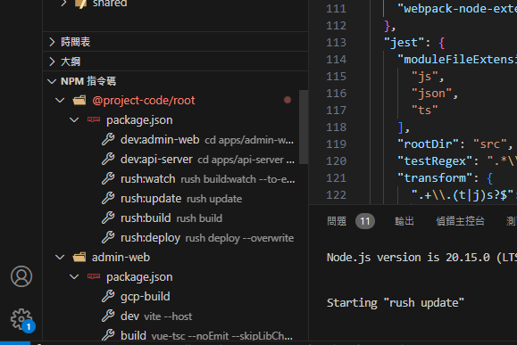

# Rush monorepo 模板

快速開始：

1. 請將「@community-voting-system」全域取代為對應的專案代號
1. ws-main.code-workspace 為目前共用的 workspace，可以複製一個自行使用。例：cod 的 workspace 為 ws-cod.code-workspace
1. VSCode 使用「檔案 -> 從檔案開啟工作區」，開啟 workspace 檔案

## 專案概述

本專案為基於 rush 的 monorepo，相關操作請詳閱 rush [文件](https://rushjs.io/zh-cn/pages/developer/everyday_commands/)

專案前後端溝通基於 [ts-rest](https://ts-rest.com/docs/intro) 建立完成型別安全之 API。

專案內容為：

- packages/shared：定義傳輸層合約與資料

  基於 TS，目前使用 tsup 編譯

- apps/api-server：實作 API 的 server

  基於 NestJS

- apps/admin-web：管理系統頁面

  基於 Vue

### 快速建立資源

推薦使用 [blueprint](https://marketplace.visualstudio.com/items?itemName=teamchilla.blueprint)

每個專案中皆有 blueprint 腳本，可以自動產生 blueprint 專用之檔案，可以快速建立各類資源。

collection-data 與 single-data 為範例資源：

- collection-data 表示集合資源，例如：使用者、文章
- single-data 表示單一資源，例如：系統設定、網站資訊

目前 blueprint 腳本會基於此兩種資源建立藍圖，可以自行修改、新增腳本。

## 腳本

> 💡 推薦使用 VSCode「npm 指令碼」功能
>
> 
>
> 如上圖，就可以直接在畫面右下角快速選擇要執行的腳本

root 中的 package.json 內含多個腳本

- `dev:{project-id}`：快速開啟對應專案的開發環境

  同執行自身專案中的 `npm run dev`

- `rush:watch`：執行編譯相依套件

  詳細說明請參閱 [watch mode](https://rushjs.io/zh-cn/pages/advanced/watch_mode/)

- `rush:update`：安裝相依套件

- `rush:build`：執行所有專案的編譯

  同執行自身專案中的 `npm run build`

- `rush:deploy`：根據 deploy.json 中設定，複製部屬用內容至 common/deploy 中，--overwrite 表示若有已存在資料夾則強制覆蓋

  詳細說明請參閱 [Deploying projects](https://rushjs.io/pages/maintainer/deploying/)

## 如何手動部屬網站

> 正常情況不需要這麼做，統一走 CI/CD 流程即可。

依序執行以下腳本：

1. root rush:build：開始建構所有專案
1. root rush:deploy：複製部屬檔案
1. 手動刪除 common/deploy/{project-id}/package.json 中 workspace:* 項目
1. 前往預計要部屬的專案（common/deploy/{project-id}）對應之 package.json，執行 deploy:xxx 腳本
1. 等待 gcloud CLI 部屬完成。
